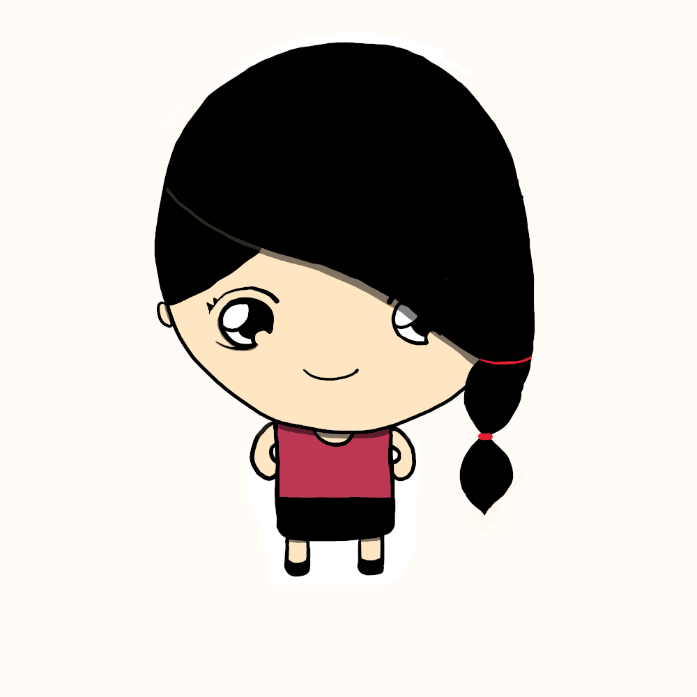
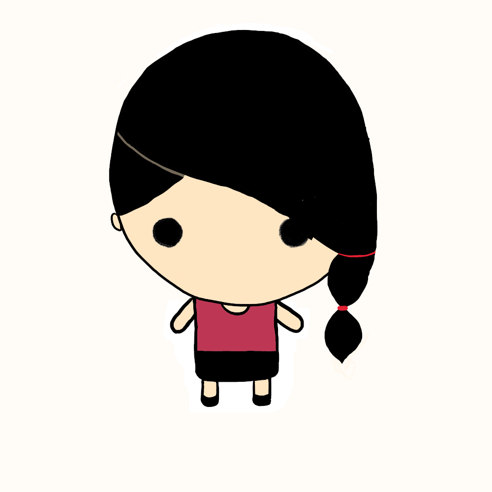

# Taygete - C++ 20 Data Structures



---

[[_TOC_]]

## Documentation

The documentation of this library was made with [mdbook](https://rust-lang.github.io/mdBook/) and is available in this [link](https://formigoni.gitlab.io/taygete).

## Conventions

Taygete adheres to C++ container conventions, that includes naming and data member availability. E.g.:

### Members

| Member Type                          |
| -------------------------------------- |
| value_type                             |
| size_type                               |
| reference                               |
| const_reference                    |
| and so on... |

### Methods
| Member Functions Classes    |
| -------------------------------------- |
|  Element access                     |
| Iterators                                  |
| Capacity                                 |
| Modifiers                                |
|  and so on...                           |


## Data Structures

### Graph

---

Naming conventions are derived from the book:

> Jonathan L. Gross, Jay Yellen, and Ping Zhang. 2013. Handbook of Graph Theory, Second Edition (2nd. ed.). Chapman & Hall/CRC.

* A graph is denoted as $`G(V,E)`$.

* $`V`$ are the _vertices_.

* $`E`$ are the edges.

* $`Endpoints`$ are/is the extrema(s) of the edges.

* Vertices that share an edge are $`Adjacent`$

* Adjacent vertices are called $`Neighbors`$.

* A $`Proper\ Edge`$ is an edge that binds Two vertices.

* A $`Multi-Edge`$ is a collection of two or more edges with the same endpoints, e.g.:

  ```mermaid
  graph LR;
  	A-- a ---B;
  	A-- b ---B;
  ```
  
  Or
  
  ```mermaid
  graph LR;
  	A-- a -->B
  	A-- b -->B
  ```

* $`Simple\ Adjacency`$ between two vertices, occurs when they share exactly one edge.

* $`Edge-Multiplicity`$ of two vertices,  is the number of edges shared by them.

* A $`Self-Loop`$ is an edge that has the same vertex as endpoints.

  ```mermaid
  graph TD;
  	A---A;
  ```

* A directed edge has a $`tail`$ and a $`head`$, the $`head`$ is the arrowhead.

## Examples

### Graph

```cpp
#include <taygete/graph/graph.hpp>

int main(int argc, char const* argv[])
{
    // Initializer list constructor
    Graph<int32_t> g
    {
        {1,5},{1,4},{2,5},{2,4},{3,5},{3,6},
        {4,7},{5,7},{6,8},{7,9},{8,9},{9,10},
    };
    // Get vertices count
    std::cout << "VC: " << g.vertex_count() << std::endl;
    // Get edges count
    std::cout << "EC: " << g.vertex_count() << std::endl;
  return EXIT_SUCCESS;
} // main
```


## Bugs?

 Issues are most welcome! You can open one for bugs, feature requests, new data structures!

Before the submission of pull requests, please follow the [Anubis](https://formigoni.gitlab.io/anubis/) C++ coding style guidelines.

