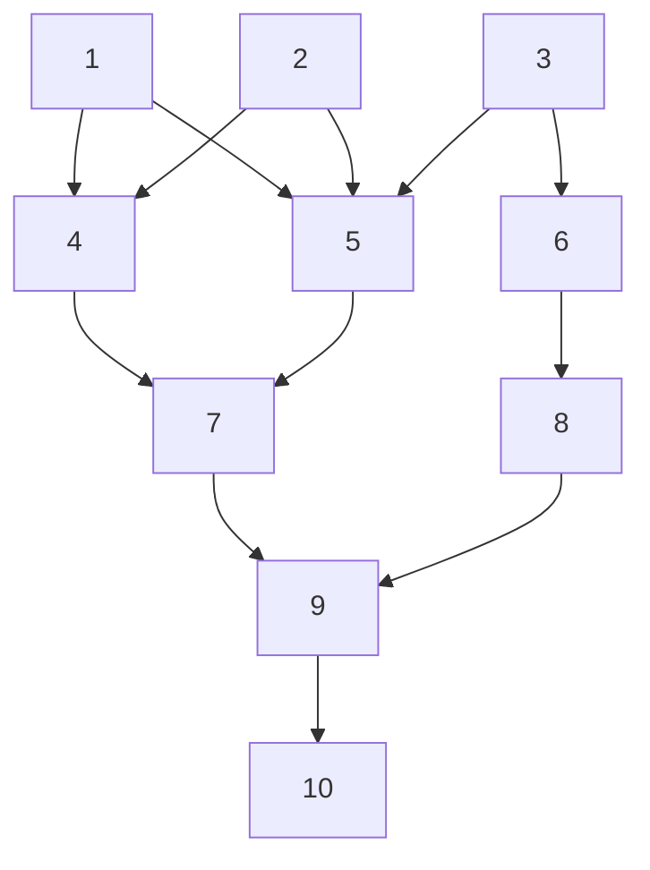

# Taygete - C++ 20 Data Structures

[[_TOC_]]

## Conventions

Taygete adheres to C++ container conventions, that includes naming and data member availability. E.g.:

### Members

| Member Type                          |
| -------------------------------------- |
| value_type                             |
| size_type                               |
| reference                               |
| const_reference                    |
| and so on... |

### Methods
| Member Functions CLASSES    |
| -------------------------------------- |
|  Element access                     |
| Iterators                                  |
| Capacity                                 |
| Modifiers                                |
|  and so on...                           |


## Data Structures

### Graph

---

Naming conventions are derived from the book:

> Jonathan L. Gross, Jay Yellen, and Ping Zhang. 2013. Handbook of Graph Theory, Second Edition (2nd. ed.). Chapman & Hall/CRC.

* A graph is denoted as $G(V,E)$.

* $V$ are the _vertices_.

* $E$ are the edges.

* $Endpoints$ are/is the extrema(s) of the edges.

* Vertices that share an edge are $Adjacent$.

* Adjacent vertices are called $Neighbors$.

* A $Proper\ Edge$ is an edge that binds two vertices.

* A $Multi-Edge$ is a collection of two or more edges with the same endpoints, e.g.:

  ```mermaid
  graph LR;
  	A-- a ---B;
  	A-- b ---B;
  ```
  
  Or
  
  ```mermaid
  graph LR;
  	A-- a -->B
  	A-- b -->B
  ```

* $Simple\ Adjacency$ between two vertices, occurs when they share exactly one edge.

* $Edge-Multiplicity$ of two vertices,  is the number of edges shared by them.

* A $Self-Loop$ is an edge that has the same vertex as endpoints.

  ```mermaid
  graph TD;
  	A---A;
  ```

* A directed edge has a $tail$ and a $head$, the $head$ is the arrowhead.



