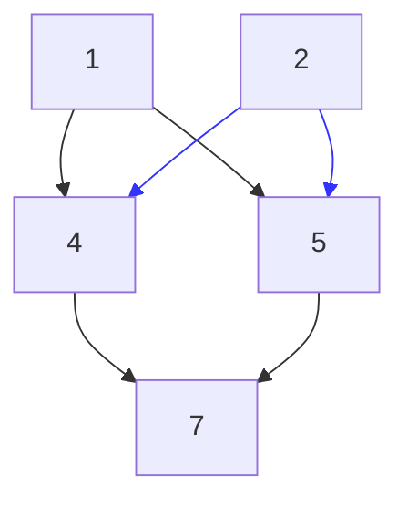
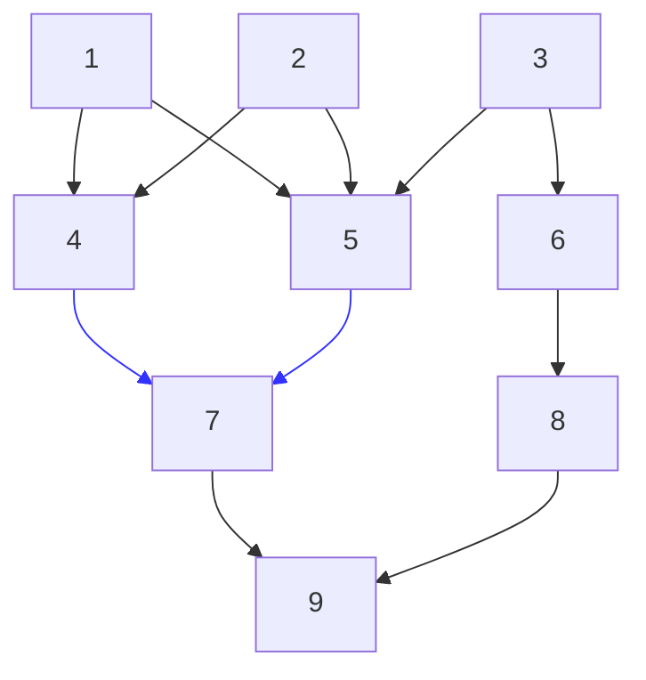
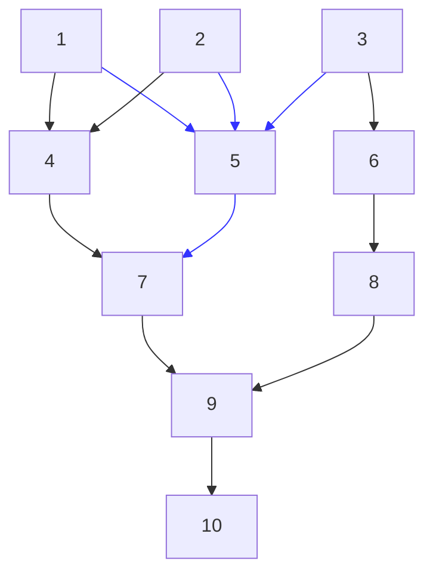
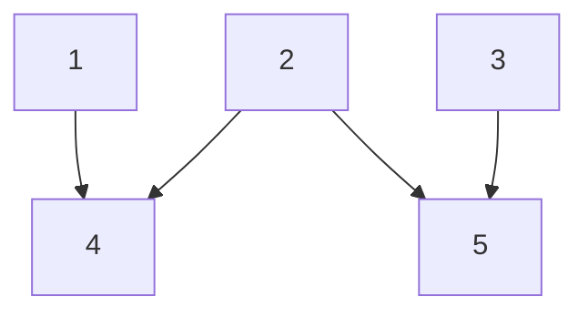
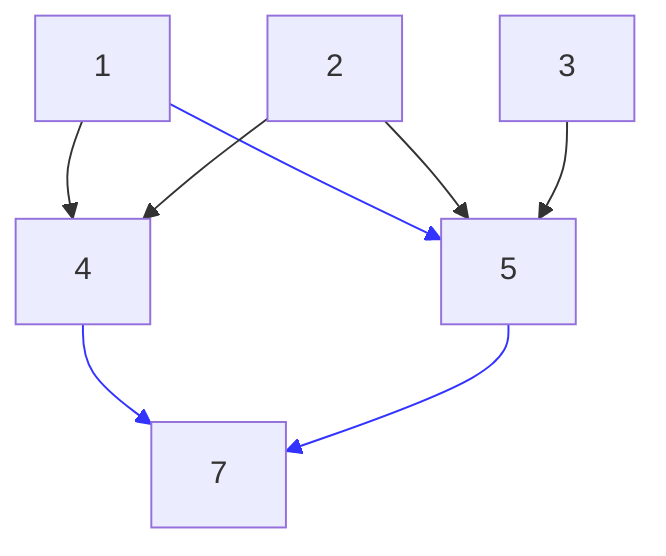
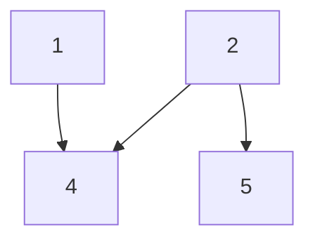

# Methods

<!-- toc -->

## Element Access

### Successors

```cpp
template<typename U>
std::vector<T> successors(U&& u) const noexcept;
```

Given a graph \\(G(V,E)\\), returns all the `outgoing` directed edges of a vertex \\(v\\).
The successors of vertex 2 are depicted below.



### Predecessors

```cpp
template<typename U>
std::vector<T> predecessors(U u) const noexcept;
```

Given a graph \\(G(V,E)\\), returns all the `incomming` directed edges of a vertex \\(v\\).
The predecessors of vertex 7 are depicted below.



### Adjacent

```cpp
template<typename U>
bool adjacent(U&& u1, U&& u2) const noexcept;
```

A vertex \\(v\\) is adjacent to \\(u\\) if it there is an edge from \\(v\\) to \\(u\\),
this method returns whether two vertices are adjacent.
In the example below `7` and `9` are the adjacent.


### Neighbors

```cpp
template<typename U>
std::vector<T> neighbors(U&& u) const noexcept;
```

Returns all the predecessors and successors of a vertex \\(v\\). In the example below,
the result of a function call to vertex 5 is demonstrated.



### Data

```cpp
Vertices<T>& data() noexcept;
```

Returns the underlying data structure.

## Capacity

### Vertices Count

```cpp
std::size_t vertices_count() const noexcept;
```

Returns the number of vertices of the graph.

### Edges Count

```cpp
std::size_t edges_count() const noexcept;
```

Returns the number of edges of the graph.

## Modifiers

### Emplace

```cpp
template<typename... U>
void emplace(U&&... u) noexcept;
```

Inserts a number of edges \\(uv\\) in a graph \\(G\\). This method takes a variable number of
arguments, those which are pairs of the base type, consider the graph:



A call to `emplace((1,5),(4,7),(5,7))`, yields a novel vertex `7`, adjacent to 4 and 5,
and makes vertex `1` adjacent to `5`.



### Erase

```cpp
template<typename U = std::pair<T,T>>
void erase(U&& u) noexcept;
```

Removes edges from a graph \\(G\\) and orphan vertices, consider the graph below:


A call to `erase(3,5)` removes the edge `3->5`, and removes vertex `3` since it is not adjacent
to any other vertex.


