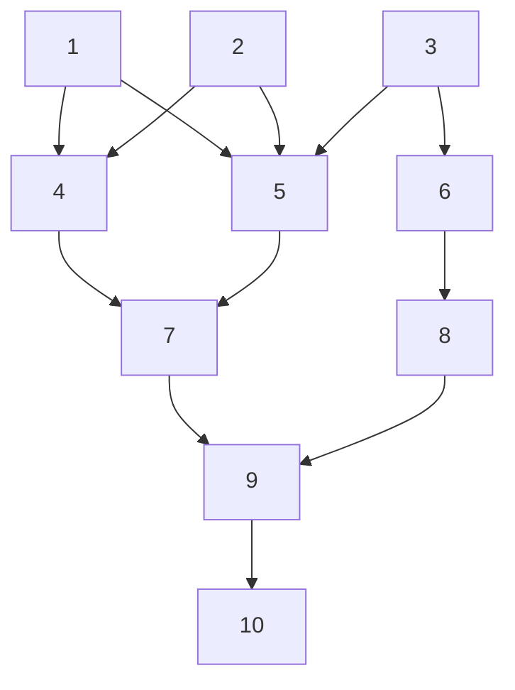

# Tests Summary

[[_TOC_]]

## Graph

The graph used for the method testing is shown below:



### Constructors

* Copy

```cpp
Graph<int32_t> dest{src};
```

* Move

```cpp
Graph<int32_t> dest{std::move(src)}; 
```

* Initializer list

```cpp
Graph<int32_t> graph{ {0,1},{0,2},{1,3},{1,4},{2,5},{2,6} };
```

* `lvalue` elements

```cpp
Graph<int32_t> graph2{ a, b, c, d, e, f };
```

* `rvalue` elements

```cpp
Graph<int32_t> graph3{p(0,1),p(0,2),p(1,3),p(1,4),p(2,5),p(2,6)};
```

### Methods

