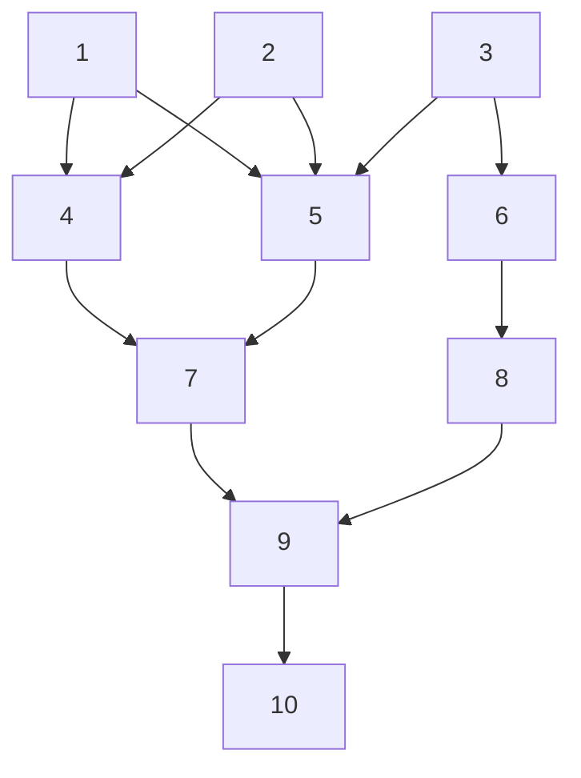

# Testing Methodology

[[_TOC_]]

## Graph

The graph used for the method testing is shown below:



### Constructors

* Copy

```cpp
Graph<int32_t> dest{src};
```

* Move

```cpp
Graph<int32_t> dest{std::move(src)}; 
```

* Initializer list

```cpp
Graph<int32_t> g{ {0,1},{0,2},{1,3},{1,4},{2,5},{2,6} };
```

* `lvalue` elements

```cpp
Graph<int32_t> g{ a, b, c, d, e, f };
```

* `rvalue` elements

```cpp
Graph<int32_t> g{p(0,1),p(0,2),p(1,3),p(1,4),p(2,5),p(2,6)};
```

### Methods

* Successors

```cpp
(g.successors(v)|ra::sort) == std::vector<V>{...};
```

* Predecessors

```cpp
(g.predecessors(v)|ra::sort) == std::vector<V>{...};
```

* Neighbors

```cpp
(g.neighbors(v) | ra::sort) == std::vector<V>{...};
```

* Adjacent

```cpp
g.adjacent(v1,v2) == bool;
```

* Vertices Count

```cpp
g.vertices_count() == size);
```

* Edges Count

```cpp
g.edges_count() == size);
```

* Emplace

``` cpp
g.emplace(edge(v1,v2),edge(v3,v4) ... );
((g.adjacent(vi,vj) = true)...);
```

